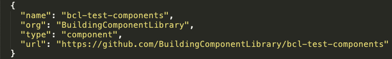
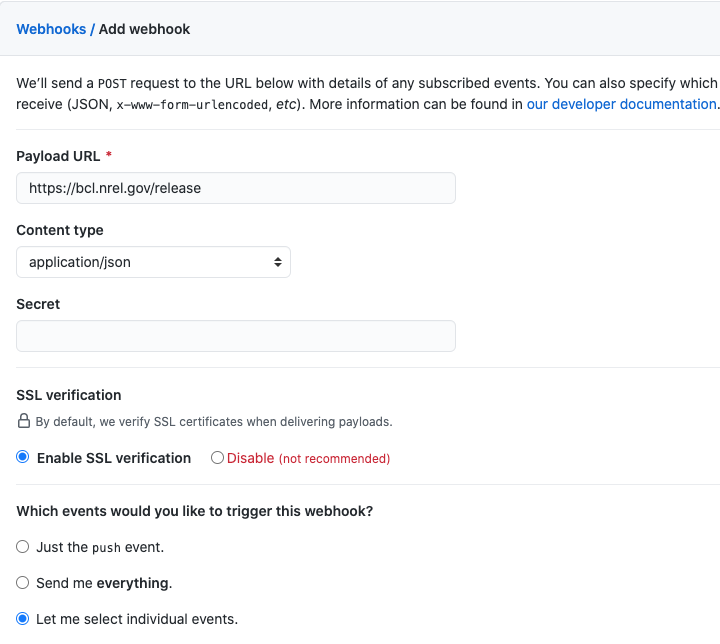
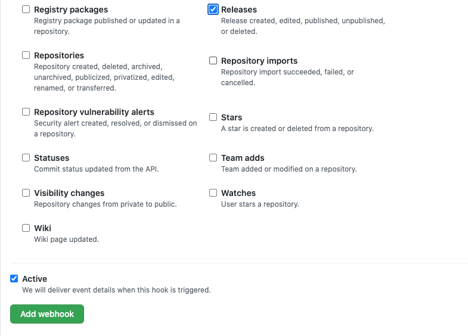

# Building Component Library Manifest

This repo is a manifest of all GitHub repositories providing content to the BCL.  Repos can be either `component` or `measure` repos.  Repos must be public and hosted on [Github.com](https://github.com).

## Contribute Content

Follow the instructions below to contribute content to the BCL.  All contributed content is public and accessible to all.

1. Review the sections below to learn how to gather existing content or create new content for the BCL.

1. Once your repository is created, clone the [BCL Manifest](https://github.com/BuildingComponentLibrary/bcl-manifest) repository and add a section to the `bcl_manifest.json` file with basic information about your repo:
	- github repo name
	- github organization
	- type of repo (enter either `measure` or `component`)
	- github URL of the repo

	

1. Create a Pull Request with your changes.  A BCL admin will review your request and repository.  If acceptable, the PR will be merged to the main branch.

1. Once the PR is merged, set up webhooks on your repository so that releases are automatically added to the BCL:
	- Select `webhooks` from the left navigation menu on your repo's `settings` page, or go to `settings/hooks`.

	- Click on the *Add webhook* button

		- Enter the payload URL: `TO BE DETERMINED`
		- Set the content type to: `application/json`
		- Select `Enable SSL verification`
		- Select `Let me select individual events` and click on the `Releases` checkbox.  We will only pull content when a release is created and published.
		- Click the *Add webhook* button at the bottom of the page.

	Screenshots of the *Add webhook* process:

	
	


1.  Create a release by going to your repo's `releases` url.

	- Click on the *Draft a new release* button
	- Enter a title, tag version, name, and description.
	- Do not check the *This is a pre-release* checkbox if you want your release added to the BCL.
	- When you are ready click on *Publish release* button

1.  The BCL will then index your new content.  To see the status of your repo, including indexing errors, visit the [BCL Dashboard](https://bcl.nrel.gov/dashboard) page.

For information on repo structure, see the Content section below.


## Content

### Measure Repos

Measure repositories should be structured as an [OpenStudio Extension Gem](https://github.com/NREL/openstudio-extension-gem).

- Follow the directions to [initialize a new extension gem](https://github.com/NREL/openstudio-extension-gem#initializing-a-new-extension-gem) for your measures

- Measures should be placed in the `lib/measures/` directory.

- While nested directories can be used to organize your measures within the `lib/measures/` directory, the structure will be flattened when imported into the BCL.  **Ensure that all measure directory names are unique across the repository.**

- Each measure directory should contain a LICENSE file.  A LICENSE.md file should also be placed in the root of your repo. The BCL can only index measures containing a license. View an [example LICENSE file](https://github.com/NREL/openstudio-extension-gem/blob/develop/LICENSE.md).

- Each measure should have a unique UUID and versionID. Use OpenStudio or PAT to create new measures so that valid UUIDs are ensured.

- Each measure should have a valid Tag classification defined in the `measure.xml` file.  The full Measure Tags hierarchy is available on the BCL website. For example, to categorize a measure as a 'QAQC' measure, use the full hierarchy path delimited with periods, as follows:
	```ruby
	<tags><tag>Reporting.QAQC</tag></tags>
	```


- Use the rake tasks provided by the OpenStudio Extension Gem to test your measures:
	```ruby
	bundle exec rake openstudio:update_measures
	bundle exec rake openstudio:test_with_openstudio
	```

- Commit the updates back to your repo.

### Component Repos

The appropriate structure for component repositories is to place components in the `lib/components/` directory.

There are no required tests to be run against components; however, it is recommended that the components are tested using a testing framework such as Ruby spec or py test.

Additional information:

- While nested directories can be used to organize your components within the `lib/components/` directory, the structure will be flattened when imported into the BCL.  **Ensure that all component directory names are unique across the repository.**

- Each component should have a unique UUID and versionID. Use OpenStudio to create new components so that valid UUIDs are ensured.

- Each component should have a valid Tag classification defined in the `component.xml` file. The full Component Tags hierarchy is available on the BCL website. For example, to categorize a component as a 'Window' component, use the full hierarchy path delimited with periods, as follows:
	```ruby
	<tags><tag>Construction Assembly.Fenestration.Window</tag></tags>
	```

## Developing New Content

TODO: Describe the workflow to follow for making new components and measures (and creating UUID/VersionID.  Point to the measure and component taxonomies.
